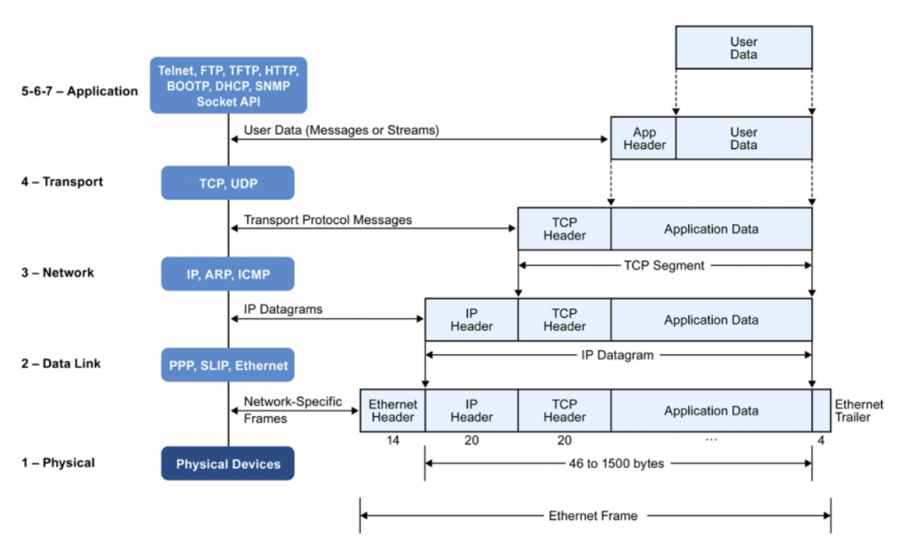
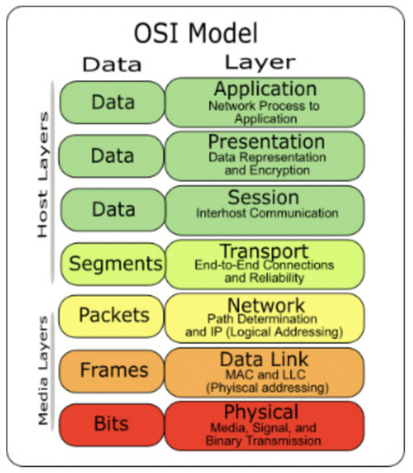

# OSI 7 계층 
## OSI 모델
- Open System Interconnection
- 네트워크 통신이 일어나는 과정을 7단계로 나눈 것

#### OSI 7 계층을 나눈 이유?
통신이 일어나는 과정을 단계별로 알 수 있고, 특정한 곳에 이상이 생기면 그 단계만 수정할 수 있기 때문 

### 1계층: 물리 계층 
> 케이블, 리피터, 허브  
- 최하위 계층 
- 데이터는 0과 1의 비트열, 즉 on과 off의 전기적 신호 상태로 이루어져 물리 계층은 단지 **데이터를 전달**하는 역할
- 단지 데이터 전달의 역할을 할 뿐이라 알고리즘, 오류 제어 기능 없음 
- **케이블, 리피터, 허브를 통해 데이터를 전송함**
----
### 2계층: 데이터링크 계층
> 브릿지, 스위치   
- 물리 계층을 통해 송수신되는 정보의 오류와 흐름을 관리하여 안전한 정보의 전달을 수행할 수 있도록 도와주는 역할 
- 두 지점(장치) 간의 신뢰성있는 전송을 보장하기 위한 계층 (Point-To-Point 전송)
- 통신에서의 오류 찾기 기능, 재전송 기능 있음
- 맥 주소를 가지고 통신함
- 데이터링크 계층에서 전송되는 데이터 단위: 프레임
- **브릿지나 스위치를 통해 맥 주소를 가지고 물리계층에서 받은 정보를 전달함**
----
### 3계층: 네트워크 계층
> 라우터, L3 스위치  
- 데이터를 목적지까지 가장 안전하고 빠르게 전달하는 기능(라우팅) 담당
- 라우터를 통해 이동할 경로를 선택하여 IP 주소를 지정하고, 해당 경로에 따라 패킷 전달
- 라우팅, 흐름 제어, 오류 제어, 세그먼테이션 등을 수행 
- 네트워크 계층에서 전송되는 데이터 단위: 패킷
	- 세그먼트에 IP 헤더가 붙은 것 
----
### 4계층: 전송 계층
> TCP/UDP  
- 통신을 활성화하기 위한 계층으로 TCP/UDP 프로토콜을 이용하여 포트를 열어 응용 프로그램들이 전송을 할 수 있게 함 
	- TCP : 신뢰성, 연결지향적
	* UDP : 비신뢰성, 비연결성, 실시간, 비순서
- 종단 간 신뢰성있고 정확한 데이터 전송을 담당
- 송신자와 수신자 간의 신뢰성있고 효율적인 데이터를 전송하기 위해 오류 검출 및 복구, 흐름 제어와 중복 검사 등 수행 
- 데이터 전송을 위해 Port 번호 사용 (대표적인 프로토콜: TCP, UDP)
- 전송 계층에서 전송되는 데이터 단위: 세그먼트 
	- 상위 계층의 데이터에 TCP 헤더가 붙은 것
----
### 5계층: 세션 계층
- 데이터가 통신하기 위한 논리적인 연결의 역할
	- 물리적 연결: 케이블을 통해 직접 연결되는 통신
	- 논리적 연결: 물리적 연결 외에 IP(논리주소), MAC address(물리주소) 등을 통해 통신 
	- TCP/IP 세션을 만들고 없애는 책임이 있음 
- 통신 장치 간 상호작용 및 동기화를 제공
	- 동기화
		- 동기점을 설정함으로써 동기점이 설정된 부분까지는 완벽하게 처리했다는 것을 뜻함
		- 이를 통해 송수신 중 오류가 발생하면 처음부터가 아닌, 동기점 이후부터 다시 재전송 
- 연결 세션에서 데이터 교환과 에러 발생 시의 복구를 관리 
- 세션 계층에서 전송되는 데이터 단위: 데이터  
----
### 6계층: 표현 계층
- 데이터를 어떻게 표현할지 정하는 역할을 하는 계층
- 코드 간 변역을 담당하는 계층
	- 사용자 시스템에서 데이터의 형식 상 차이를 다루는 부담을 응용 계층으로부터 덜어줌 
	- MIME 인코딩이나 암호화 등의 동작이 이 계층에서 이루어짐 
		- MIME: 전자 우편을 위한 인터넷 표준 포맷 
		- ex) 이미지 인코딩 -> JPEG, MPEG 등으로 변환
		- 해당 데이터가 Text 인지 img 인지, gif인지 jpg인지 구분을 이 계층에서 수행 
----
### 7계층: 응용 프로그램 계층 
> 웹 브라우저: Chrome, Firefox 등  
> 응용 프로그램: Skype, Office 등  
- 응용 프로세(크롬이란 웹 클라이언트에 접속해)스와 직접 관계하여 일반적인 응용 서비스(HTTP 프로토콜 등)를 수행하는 계층 
- 전송된 메일, 사진, 동영상 등이 크롬이나 사파리 등의 응용프로그램을 통해 사용자가 눈으로 확인할 수 있는 과정이며, 이 데이터들은 해당되는 프로토콜(HTTP, FTP, SMTP 등)에 의해 처리됨
	- HTTP: HTTP라는 Application Layer의 프로토콜은 응용 프로그램인 웹이나 브라우저에 필요한 데이터를 송수신할 때 사용
	- FTP: 파일 전송 프로토콜로 서버와 클라이언트 사이의 파일을 주고 받을 때 사용 
- 최상위 계층으로 사용자에게 직접적으로 보이는 부분 

## 데이터 캡슐화

- 데이터를 보낼 때는 7계층 -> 1계층으로 가며 이 과정에서 캡슐화를 하는데, 각 계층은 다른 계층과 통신할 때 데이터에 특정 정보가 들어있는 Header와 Footer를 추가한 후 다른 계층으로 전달함 
- 아래 계층으로 내려갈 수록 PDU(Protocol Data Unit, 프로토콜 데이터 단위)에는 다양한 프로토콜에 의해 Header와 Footer가 더해짐 (캡슐화)
- 반대로 데이터를 받은 컴퓨터가 PDU로부터 프로토콜의 Header와 Footer를 분석하며 올라가 마지막 응용 계층에 도달하면 원본 데이터만 남음 (디캡슐화)

## 예상 질문 
- PC 방에서 게임을 하는 중 연결이 끊어졌을 때, 어디에 문제가 있는지 확인하기 위해서
	- 모든 PC가 문제가 있다면 **라우터의 문제**(**3계층 네트워크 계층**)이거나 **광랜을 제공하는 회사의 회선 문제**(**1계층 물리 계층**)라고 판단할 수 있다.
	- 한 PC에만 문제가 있고 게임 소프트웨어에 문제가 없고 스위치에 문제가 있으면 **2계층 데이터 링크 계층**에 문제가 있다고 판단할 수 있다.
	- 그렇다면 게임 소프트웨어에 문제가 있다면 어떤 계층의 문제라고 판단내릴 수 있을까? 

- OSI 7계층과 TCP/IP 계층의 차이가 무엇일까요?
- 왜 실제 통신에서 TCP/IP 계층을 보통 더 많이 사용할까요?

### 출처
- [네트워크 OSI 7Layer / 7계층 개념 및 역할, 구조까지 한번에 알아보기](https://onecoin-life.com/19)
- [네트워크 OSI 7 계층 (OSI 7 LAYER) 기본 개념, 각 계층 설명](https://velog.io/@cgotjh/%EB%84%A4%ED%8A%B8%EC%9B%8C%ED%81%AC-OSI-7-%EA%B3%84%EC%B8%B5-OSI-7-LAYER-%EA%B8%B0%EB%B3%B8-%EA%B0%9C%EB%85%90-%EA%B0%81-%EA%B3%84%EC%B8%B5-%EC%84%A4%EB%AA%85)
- https://shlee0882.tistory.com/110
- [네트워크 | OSI 7 계층 그림과 함께 이해하기](https://velog.io/@jeongs/%EB%84%A4%ED%8A%B8%EC%9B%8C%ED%81%AC-OSI-7-%EA%B3%84%EC%B8%B5-%EA%B7%B8%EB%A6%BC%EA%B3%BC-%ED%95%A8%EA%BB%98-%EC%9D%B4%ED%95%B4%ED%95%98%EA%B8%B0) -> 여기 설명 잘 되어 있음! 참고하기 
